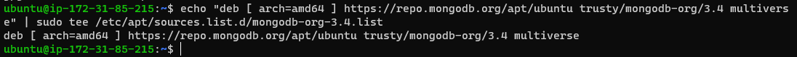
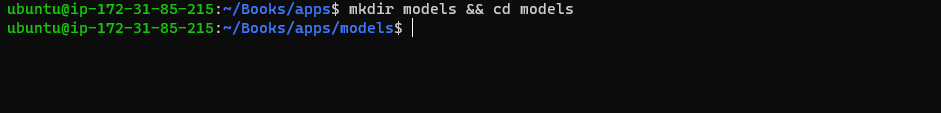
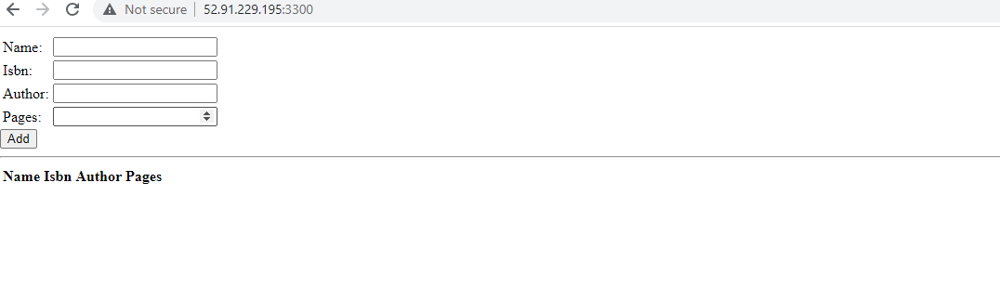

# Project 4: Mean Stack Implementation

### Firstly, I connected my Ec2 instance and remote into the terminal. And below are the following steps i took to get this project done.

## Step 1: Install Nodejs
1. I ran `sudo apt update` Since this is my first time using apt for this session, so, i started off by updating my server’s package index and below is the output.

2. I ran `sudo apt upgrade` to upgrade ubuntu server and below is the output.

3. I ran `sudo apt -y install curl dirmngr apt-transport-https lsb-release ca-certificates` and `curl -sL https://deb.nodesource.com/setup_18.x | sudo -E bash -
` to add certificates and below are the outputs respectively.

4. I ran `sudo apt install -y nodejs` to install Nodejs and below is the output.

## Step 2: Install MongoDB
1. I ran `sudo apt-key adv --keyserver hkp://keyserver.ubuntu.com:80 --recv 0C49F3730359A14518585931BC711F9BA15703C6` and `echo "deb [ arch=amd64 ] https://repo.mongodb.org/apt/ubuntu trusty/mongodb-org/3.4 multiverse" | sudo tee /etc/apt/sources.list.d/mongodb-org-3.4.list` and below are the output respectively.

2. I ran `sudo apt install -y mongodb` to install MongoDB and below is the output.

3. I ran `sudo service mongodb start` to start the server and below is the output.

4. I ran `sudo systemctl status mongodb` to verify that the service is up and running and below is the output.

5. I ran `sudo apt install -y npm` to install npm package-node package manager but unfortunately i got an error which i solved by installing aptitude to install to be able to install the packages and below are the outputs, from the error down to the result.

a. The error

     
     b. installation of aptitude using `sudo apt install aptitude -y`
     
     c. Install your package with aptitude using `sudo aptitude install npm`
     
     d. To confirm npm installed use `npm --version`

6. I ran `sudo npm install body-parser` to body-parser passage and below is the output.

7. I ran `mkdir Books && cd Books` to create a new directory and change directory to Books and below is the output.

8. I ran `npm init` to initialize npm project, click enter throughout the prompt and the yes at the end. See the ouput below.

9. I ran `vi server.js` to add a file named server. js then, Copy and paste the web server code below into the server.js file, save and exit.

## Step 3: Install Express and set up routes to the server
1. I ran `sudo npm install express mongoose` to install express mongoose and below is the output.

2. I ran `mkdir apps && cd apps` to create a new directory and change directory to apps and below is the output.

3. I ran `vi routes.js` to craete and open a file named routes.js then, paste the codes and below is the output.

4. I ran `mkdir models && cd models` to create a new directory and change directory to models and below is the output.

5. I ran `vi book.js` to craete and open a file named book.js then, paste the codes and below is the output.

## Step 4: Access the routes with AngularJS
1. I ran `cd ../..` to change the directory back to ‘Books’ and below is the output.

2. I ran `mkdir public && cd public` to create a new directory and change directory to public and below is the output.
 

3. I ran `vi script.js` to craete and open a file named script.js then, paste the codes and below is the output.

4. I ran `vi index.html` to craete and open a file named index.html then, paste the codes and below is the output.

5. I ran `cd ..` to change the directory back to ‘Books’ and below is the output.

6. I ran `node server.js` to start the server and below is the output.

7. Here, i launch a separate SSH console to test what curl command `curl -s http://localhost:3300` returns locally and below is the output.

8. I opened TCP port 3300 in my AWS Web Console for my EC2 Instance to be able to access Book Register web application from the Internet and below is the output.

9. Access Book Register web application from  the internet and below is the output.

10. I added as many informations as possible from mybrowser and it appeared on the local host whiich shows successful and below are the outputs.

